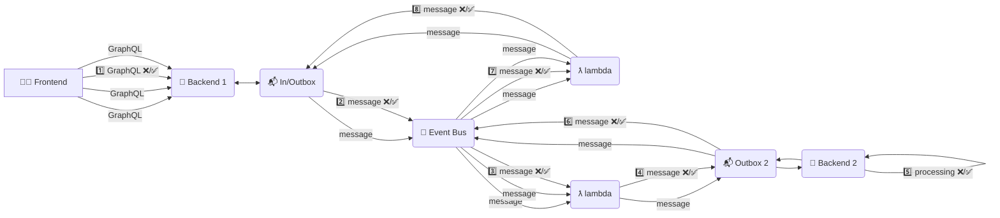

# Evented fault simulator

[
](https://github.com/failure-driven/evented-fault-simulator/actions/workflows/main.yml)

## TL;DR

```sh
make
make install

make test

make demo

make clean
```

**🧪 experimental**

```sh
make launch-server
curl -N http://0.0.0.0:9292

# NOTE: will need to kill server manually finding it via the puma job

make launch-simulator
http://localhost:4200/

# will display 10 most recent events in the browser
# fire up some events with
repeat 10 {
  SIMPLE_TELEMETRY_HOST=localhost \
  SIMPLE_TELEMETRY_PORT=1234 \
  ./e2e-tests/bin/example-process.rb \
  `uuidgen` & }
```

## Evented simulator

Imagine a system where you have



1. **Frontend** can fail to communicate to the **backend**
2. **Backend** outbox can fail to publish to the **event bus**
3. **Event bus** message may fail to be read by a **lambda**
4. **Lambda** may fail to write to the **Inbox** of anouther **backend** Inbox
5. **processing** could fail on the microservice
6. **Outbox** of microservice may fail to publis to the **event bus**
7. **Event bus** message may fail to be read by a **lambda**
8. **Lambda** may fail to write to the **Inbox**

The idea is to have simple telemetry system that takes telemetry data from each
"service" and is displayed in a frontend visulaisation system.

## Thoughts

- [ ] This is probably already handled by something like
https://github.com/open-telemetry/opentelemetry-demo
- [ ] next up add a web server that serves the data as a stream over
  websockets?
    - [ ] https://github.com/socketry/async-websocket
    - [ ] server https://github.com/socketry/falcon
    - have server running using rack, but need to refresh to get a message,
      time to switch that around to being a websocket message stream

