# Evented fault simulator

[
](https://github.com/failure-driven/evented-fault-simulator/actions/workflows/main.yml)

## TL;DR

```sh
make
make install

make test

make demo

make clean
```

**🧪 experimental**

```sh
make launch-server
curl -N http://0.0.0.0:9292 # old puma under ruby 3.2.2
curl -N http://0.0.0.0:8080 # Webrick under ruby 3.3.1

# NOTE: will need to kill server manually finding it via the puma job

make launch-simulator
http://localhost:4200/

# will display 10 most recent events in the browser
# fire up some events with
repeat 10 {
  SIMPLE_TELEMETRY_HOST=localhost \
  SIMPLE_TELEMETRY_PORT=1234 \
  ./e2e-tests/bin/example-process.rb \
  `uuidgen` & }
```

## Evented simulator

Imagine a system where you have

```mermaid
flowchart LR
    A["🧑‍💻 Frontend"] -->|GraphQL| B1("💾 Backend 1")
    A -->|GraphQL| B1
    A -->|"1️⃣ GraphQL ❌/✅"| B1
    A -->|GraphQL| B1
    B1 <--> IOB("📬 In/Outbox")
    IOB -->|message| EB("🚐 Event Bus")
    IOB -->|"2️⃣ message ❌/✅"| EB
    EB -->|message| L1("ƛ lambda")
    EB -->|"7️⃣ message ❌/✅"| L1
    EB -->|message| L1
    L1 -->|message| IOB
    L1 -->|"8️⃣ message ❌/✅"| IOB
    EB -->|message| L2("ƛ lambda")
    EB -->|message| L2
    EB -->|"3️⃣ message ❌/✅"| L2
    L2 -->|message| IOB2("📬 In/Outbox")
    L2 -->|"4️⃣ message ❌/✅"| IOB2
    IOB2 --> B2("💾 Backend 2")
    IOB2 -->|message| EB
    IOB2 -->|"6️⃣ message ❌/✅"| EB
    B2 -->|processing| B2
    B2 -->|"5️⃣ processing ❌/✅"| B2
    B2 --> IOB2("📬 Outbox 2")
```



1. **Frontend** can fail to communicate to the **backend**
2. **Backend** outbox can fail to publish to the **event bus**
3. **Event bus** message may fail to be read by a **lambda**
4. **Lambda** may fail to write to the **Inbox** of anouther **backend** Inbox
5. **processing** could fail on the microservice
6. **Outbox** of microservice may fail to publis to the **event bus**
7. **Event bus** message may fail to be read by a **lambda**
8. **Lambda** may fail to write to the **Inbox**

The idea is to have simple telemetry system that takes telemetry data from each
"service" and is displayed in a frontend visulaisation system.

## Thoughts

- [ ] This is probably already handled by something like
https://github.com/open-telemetry/opentelemetry-demo
- [ ] next up add a web server that serves the data as a stream over
  websockets?
    - [ ] https://github.com/socketry/async-websocket
    - [ ] server https://github.com/socketry/falcon
    - have server running using rack, but need to refresh to get a message,
      time to switch that around to being a websocket message stream

## TODO

- [ ] display events next to "clients"
- [ ] change visual display from "logs" to "sprites"
- [ ] a way to display many "client sprites" on a limited page
- [ ] build a client into a rails/ruby `Faraday` process
- [ ] build a client into a `sidekiq` process
- [ ] build a client into a lambda client running on openstack
- [ ] switch to using docker
- [ ] extract JSON serialization into own class in `Simple::Telemetry`
- [ ] errors in E2E spec
  ```
  lifecycle of process
      Given simple telemetry client is running
  #<Thread:0x00007f4dbb9f91c8 /home/...spec/support/process_runner.rb:19 run>
                      terminated with exception (report_on_exception is true):
  /home/...spec/support/process_runner.rb:21:in `gets':
                      stream closed in another thread (IOError)
  	from /home/...spec/support/process_runner.rb:21:in `block in run'
      When sample process starts
      Then telemetry client receives ProcessStarted message (FAILED)
  #<Thread:0x00007f4dbb808a30 /home/...spec/support/process_runner.rb:19 run>
                      terminated with exception (report_on_exception is true):
  /home/...spec/support/process_runner.rb:21:in `gets':
                      stream closed in another thread (IOError)
  	from /home.../spec/support/process_runner.rb:21:in `block in run'
  ```
  - [ ] add a test timeout to kill the test after a short period of time
  - [ ] has been turned off in GitHub Actions as it uses a `6 hour` job timeout
    rather than a test timeout
  - [ ] fix it

## DONE

...
